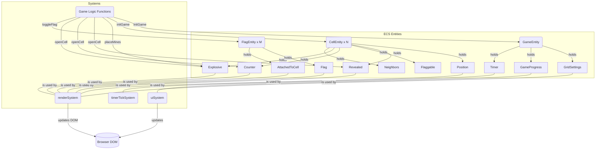
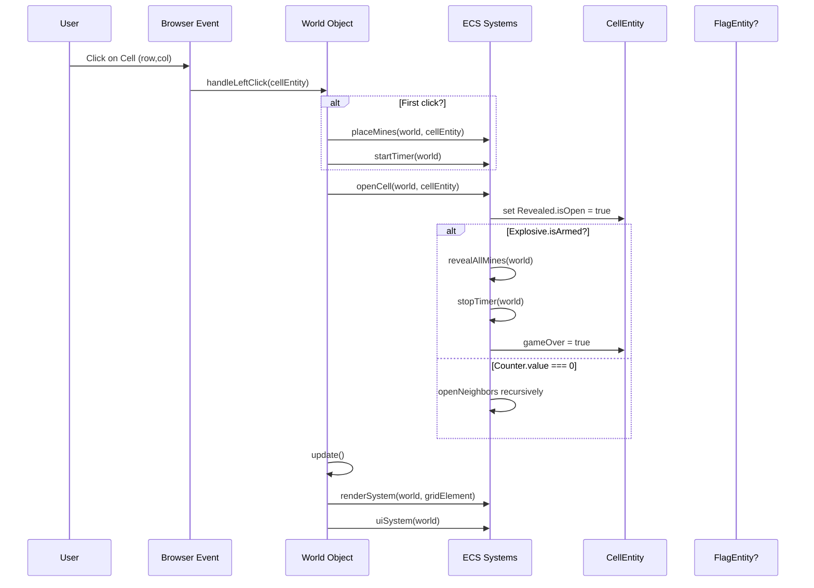
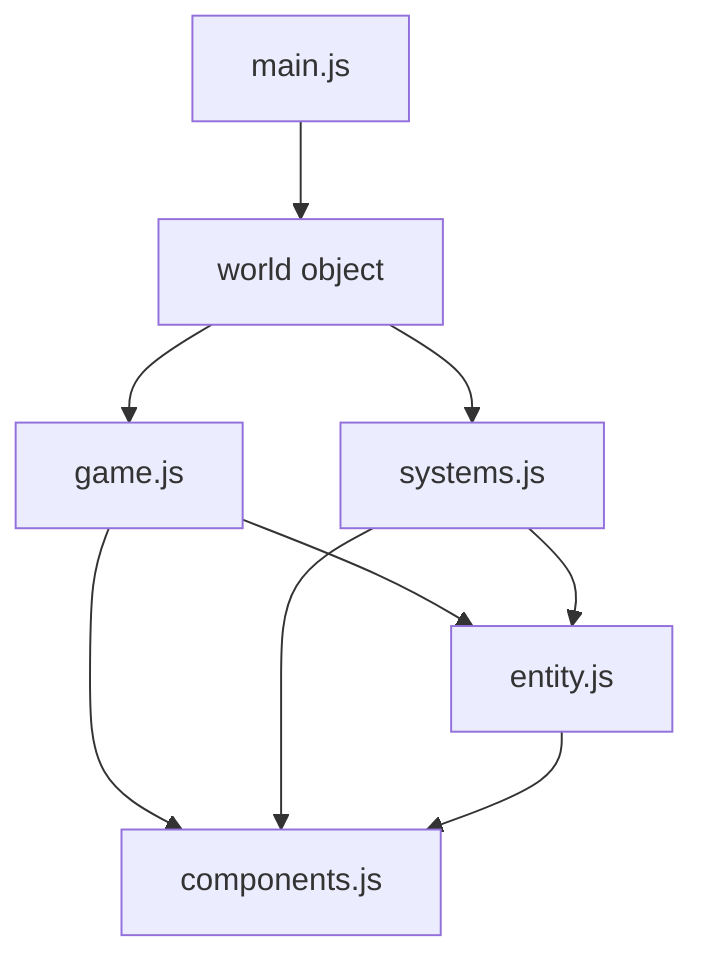

# ECS Architecture Overview

このドキュメントでは、Minesweeper を例にとった **Entity-Component-System（ECS）** アーキテクチャの概要を示します。  
ゲームを構成する **エンティティ（Entity）**、それぞれが保持する **コンポーネント（Component）**、および処理を行う **システム（System）** がどのように関連しているかを図とともに解説します。

## 1. ECS の基本構造

### 1.1. Entity

- **GameEntity**  
  - ゲーム全体の状態を管理するエンティティ  
  - `GridSettings`, `GameProgress`, `Timer` のコンポーネントを保持  
- **CellEntity**  
  - 盤面上の各セルを表すエンティティ  
  - `Position`, `Revealed`, `Flaggable`, `Counter`, `Explosive`, `Neighbors` のコンポーネントを保持  
- **FlagEntity**  
  - 旗オブジェクトを表すエンティティ  
  - `Flag`, `AttachedToCell` のコンポーネントを保持  

### 1.2. Component

現在実装されているコンポーネント：

- **Position**: 何行目(`row`)・何列目(`col`)にあるか  
- **Revealed**: セルが開いているか（`isOpen`: true/false）  
- **Flaggable**: 旗を立てられる対象かどうか（有無のみ）  
- **Counter**: 周囲の爆発物数（地雷数）を保持（`value`）  
- **Explosive**: 地雷など爆発物であるか（`isArmed`: true/false）  
- **Neighbors**: 隣接セルのエンティティID一覧（`neighborIds`）  
- **Flag**: 旗であることを示す（有無のみ）  
- **AttachedToCell**: どのセル（`cellId`）に取り付けられているか  
- **GridSettings**: グリッドの行数（`rows`）・列数（`cols`）  
- **GameProgress**: 開いたセル数（`revealed`）・旗数（`flags`）・地雷数（`totalMines`）・ゲーム終了フラグ（`gameOver`）  
- **Timer**: 経過時間（`time`）・タイマーの識別子（`intervalId`）  

### 1.3. System

現在実装されているシステム：

- **renderSystem**  
  - すべての CellEntity / FlagEntity を走査し、画面（DOM）に反映  
  - `Position`, `Revealed`, `Explosive`, `Counter`, `Flag`, `AttachedToCell` を参照して表示を切り替え  
- **uiSystem**  
  - `GameProgress` や `Timer` を参照し、残り地雷数や経過時間を更新  
  - ベストスコアの表示も担当  
- **timerTickSystem**  
  - 毎秒呼び出され、`Timer` の `time` を加算  

ゲームロジックの主要関数（game.js）：

- **initGame**: ゲームの初期化とエンティティの作成
- **placeMines**: 初回クリック時に地雷を配置
- **openCell**: セルを開き、関連するロジックを処理
- **toggleFlag**: セルに旗を立てる/外す
- **startTimer/stopTimer**: タイマー管理

---

## 2. アーキテクチャ概要図

以下の図は、ECS 内の主なエンティティ・コンポーネントと、代表的なシステムの流れを示したものです。  
（実際の実装に基づいています）

左側（ECS Entities）: エンティティと付随コンポーネントの構造  
右側（Systems）: System がどのコンポーネントを使用するかの関係  
UI (Browser DOM): 実際にユーザーに見える画面。renderSystem や uiSystem が操作

注: この図は概念図であり、実際の処理シーケンスや依存関係をすべて網羅するものではありません。

## 3. イベントフローの簡易シーケンス図

ユーザーがセルをクリックした際の流れを、実際の実装に基づいて示します。

現在の実装では、`World`オブジェクトがイベントハンドラを管理し、システムやゲームロジック関数を呼び出す中央的な役割を果たしています。

## 4. 各コンポーネントとシステムの関連

### コンポーネント一覧

| コンポーネント | 用途 | 主なプロパティ | 主な参照元 (System/関数) |
|---------------|------|--------------|------------------------|
| Position | 行・列情報 | row, col | renderSystem, placeMines, findCell |
| Revealed | 開閉状態 | isOpen: boolean | openCell, renderSystem |
| Flaggable | 旗を立てられるセルか | - (有無のみ) | toggleFlag |
| Counter | 周囲の地雷数 | value: number | calculateAdjacentMines, renderSystem, openCell |
| Explosive | 地雷など爆発物 | isArmed: boolean | placeMines, openCell, renderSystem |
| Neighbors | 隣接セルのエンティティID一覧 | neighborIds: ID[] | openCell (再帰的に開く処理) |
| Flag | 旗エンティティ | - (有無のみ) | renderSystem, createFlagEntity |
| AttachedToCell | どのセルに旗を取り付けるか | cellId: number | renderSystem, toggleFlag, findFlagOnCell |
| GridSettings | グリッドの行列数など | rows, cols | renderSystem, initGame, placeMines |
| GameProgress | ゲーム進行情報 | revealed, flags, totalMines, gameOver | openCell, toggleFlag, uiSystem |
| Timer | 時間計測 | time, intervalId | startTimer, stopTimer, timerTickSystem, uiSystem |

### システムと主要関数一覧

| 名前 | 種類 | 主な処理内容 | 読み書きするコンポーネント |
|-----|-----|------------|-------------------------|
| renderSystem | System | エンティティを DOM に描画。セルの状態や旗をチェック | Position, Revealed, Explosive, Counter, Flag, AttachedToCell |
| uiSystem | System | ゲーム進行情報やタイマーを UI に表示 | GameProgress, Timer |
| timerTickSystem | System | 毎秒呼ばれてタイマーを進める | Timer |
| initGame | 関数 | エンティティ作成とゲーム初期化 | すべてのコンポーネント |
| placeMines | 関数 | 地雷をランダム配置 | Explosive, Position |
| calculateAdjacentMines | 関数 | 各セルの周囲地雷数を計算 | Counter, Neighbors |
| openCell | 関数 | セルを開く（再帰的に処理） | Revealed, Counter, Explosive, Neighbors |
| toggleFlag | 関数 | 旗の設置/除去 | Flag, AttachedToCell |
| startTimer/stopTimer | 関数 | タイマーの開始/停止 | Timer |

## 5. 実際の実装構造

現在の実装は、純粋なECSパターンではなく、以下のハイブリッド構造を採用しています：

- **world**オブジェクト: エンティティの集合とイベントハンドラを持つ中央管理オブジェクト
- **entity.js**: エンティティの作成と操作に関する基本関数
- **components.js**: 各コンポーネントを定義するファクトリ関数
- **systems.js**: レンダリングやUIなどのシステム関数
- **game.js**: ゲームロジック固有の関数（初期化、地雷配置、セルを開く等）

## 6. 運用ポリシー

- コンポーネントは単一責任
  - 例: Revealed は「セルの開閉状態を表す」責務のみ
- システムは「何を読み込み、何を変更するか」を明確化
  - renderSystem - 表示のみを担当
  - uiSystem - UI要素の更新
  - timerTickSystem - タイマーのカウントアップ
- 拡張性を考慮
  - 新しいエンティティタイプやコンポーネントは既存のシステムと協調動作できる
  - 例：新しいパワーアップアイテムを追加する場合は、新コンポーネント定義と、必要に応じてシステム修正

## 7. まとめ

このドキュメントでは、Minesweeper の実装に使用されている ECS 構造の概観と、エンティティ・コンポーネント・システムの関連を示しました。
実際の実装では完全な ECS パターンではなく、ゲームロジック関数と ECS を組み合わせたハイブリッドアプローチを採用しています。

特徴：
- エンティティとコンポーネントの分離によるデータとロジックの明確な分離
- システムによる共通処理の定義
- 新機能追加時の柔軟性

本ドキュメントをベースに、さらに詳細な実装（components.js, systems.jsなど）の説明や、新コンポーネントの追加手順などを補足していくと、チームメンバー全員で参照しやすい形になるでしょう。